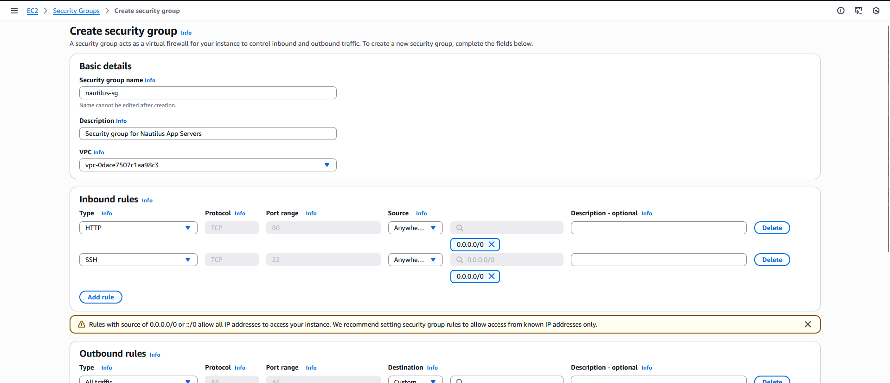
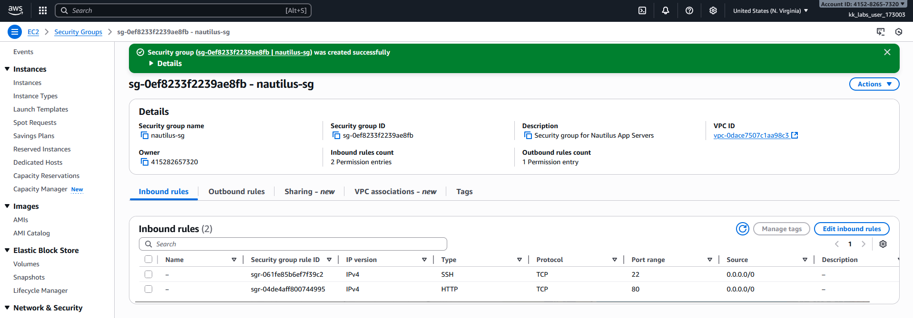

# Question
The Nautilus DevOps team is strategizing the migration of a portion of their infrastructure to the AWS cloud. Recognizing the scale of this undertaking, they have opted to approach the migration in incremental steps rather than as a single massive transition. To achieve this, they have segmented large tasks into smaller, more manageable units. This granular approach enables the team to execute the migration in gradual phases, ensuring smoother implementation and minimizing disruption to ongoing operations. By breaking down the migration into smaller tasks, the Nautilus DevOps team can systematically progress through each stage, allowing for better control, risk mitigation, and optimization of resources throughout the migration process.
For this task, create a security group under default VPC with the following requirements:
Name of the security group is datacenter-sg.

The description must be Security group for Nautilus App Servers

Add the inbound rule of type HTTP, with port range of 80. Enter the source CIDR range of 0.0.0.0/0.

Add another inbound rule of type SSH, with port range of 22. Enter the source CIDR range of 0.0.0.0/0.

#### Step by-step solution

Login to AWS Console:

Go to: https://415282657320.signin.aws.amazon.com/console?region=us-east-1

Username: `given in lab`

Password: `given in lab`

Navigate to EC2 Service:

Once logged in, type "EC2" in the search bar at the top

Click on "EC2" from the search results

Create Security Group:

In the left sidebar, scroll down to the "Security" section

Click on "Security Groups"

Click the orange "Create security group" button at the top right

Configure Basic Details:

Security group name: Enter nautilus-sg

Description: Enter Security group for Nautilus App Servers

VPC: Make sure it's set to the default VPC (it should be selected by default)

Add Inbound Rules:

First Rule - HTTP:

Click "Add rule"

Type: Select HTTP

Port range: Should auto-fill to 80

Source: Select Custom and enter 0.0.0.0/0

Second Rule - SSH:

Click "Add rule" again

Type: Select SSH

Port range: Should auto-fill to 22

Source: Select Custom and enter 0.0.0.0/0

Create Security Group:

Scroll down and click the orange "Create security group" button

---