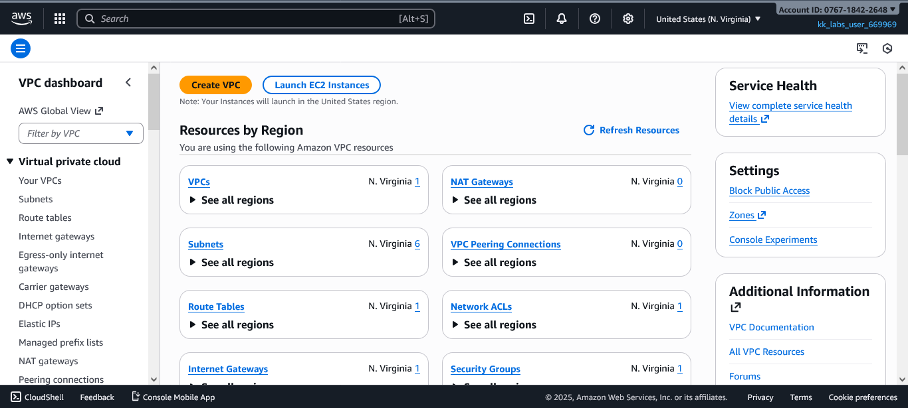
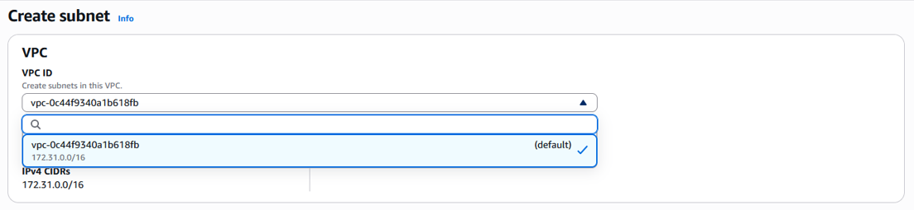
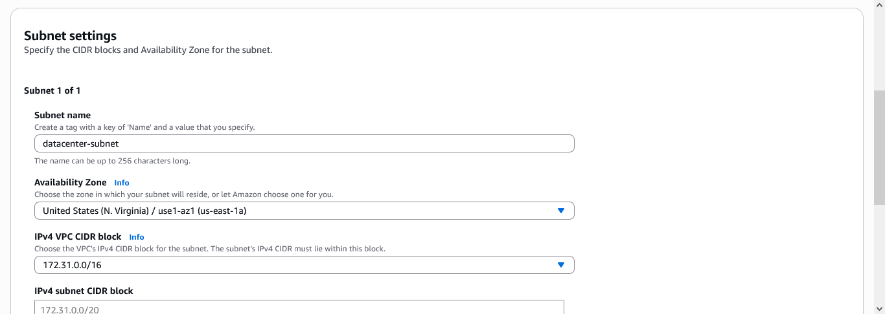
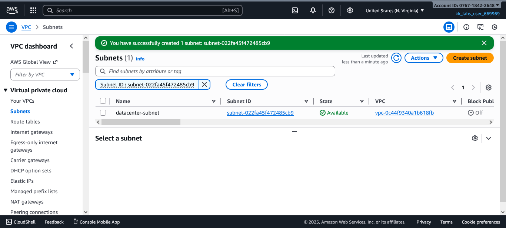

# Question
The Nautilus DevOps team is strategizing the migration of a portion of their infrastructure to the AWS cloud. Recognizing the scale of this undertaking, they have opted to approach the migration in incremental steps rather than as a single massive transition.

For this task, create one subnet named datacenter-subnet under default VPC.

# Day 3: Create Subnet

For this task, create one subnet named `datacenter-subnet` under default VPC.

### Step 1: Go to VPC Dashboard

### Step 2: Click on `Subnets` and Selects `Default VPC`

### Step 3: Set Subnet Name as `datacenter-subnet` and choose any availability zone.

**Note: This task requires choosing the correct IPv4 subnet CIDR block. To do this, you must review all existing subnets in your default VPC to ensure that the block you enter does not overlap with any existing subnet.**

### Click on "Create Subnet" and review

