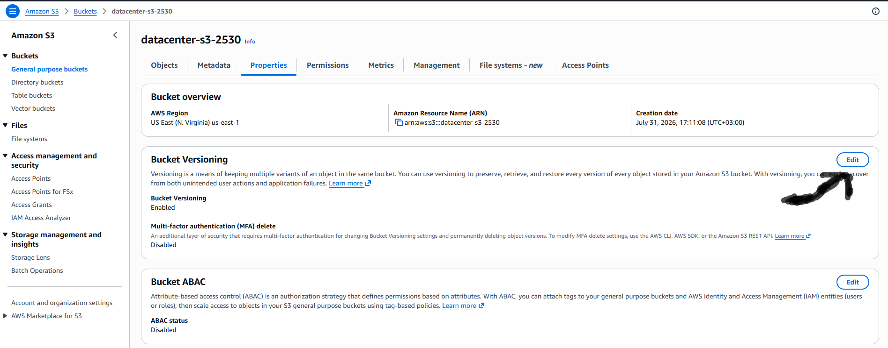
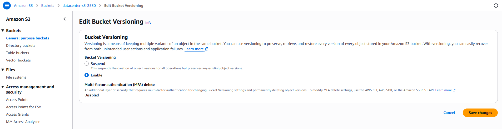

# Question

Data protection and recovery are fundamental aspects of data management. It's essential to have systems in place to ensure that data can be recovered in case of accidental deletion or corruption. The DevOps team has received a requirement for implementing such measures for one of the S3 buckets they are managing.
> The s3 bucket name is datacenter-s3-2530, enable versioning for this bucket.

# Step-by-step Solution

### Navigate to Amazon S3

AWS Management Console.Log in to the AWS Management Console.Search for S3 in the top search bar and select S3 under Services.

### Open Bucket Details

Bucket Selection.From the General purpose buckets list, find and click on the name of your bucket: datacenter-s3-2530.

### Locate Versioning Settings:Properties Tab

Click on the Properties tab located near the top of the bucket dashboard.Scroll down to the Bucket Versioning section.

### Enable Bucket Versioning:
**Configuration**

Click the Edit button on the right side of the Bucket Versioning card.Under Bucket Versioning, select Enable.Click Save changes at the bottom of the page.
**Verification**
To verify that versioning is enabled, return to the Properties tab of datacenter-s3-2530 and ensure that Bucket Versioning displays Enabled.