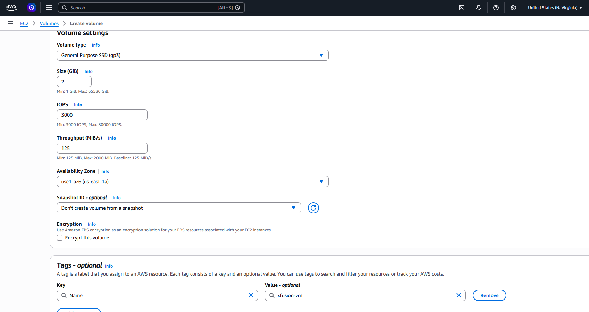

# Question

The Nautilus DevOps team is strategizing the migration of a portion of their infrastructure to the AWS cloud. Recognizing the scale of this undertaking, they have opted to approach the migration in incremental steps rather than as a single massive transition. To achieve this, they have segmented large tasks into smaller, more manageable units. This granular approach enables the team to execute the migration in gradual phases, ensuring smoother implementation and minimizing disruption to ongoing operations. By breaking down the migration into smaller tasks, the Nautilus DevOps team can systematically progress through each stage, allowing for better control, risk mitigation, and optimization of resources throughout the migration process.
##### **Create a volume with the following requirements:
Name of the volume should be devops-volume.

Volume type must be gp3.

Volume size must be 2 GiB.
***

# Step-by-step Solution

1. ***Navigate to the EC2 Dashboard:***
- AWS Management Console.
Log in to the AWS Management Console.Search for EC2 in the top search bar and select EC2 under Services.

2. ***Open the Volumes Section:***
- Elastic Block Store.
In the left navigation pane under Elastic Block Store, click on Volumes.Click the orange Create volume button at the top right of the page.

3. ***Configure Volume Settings:***
- Volume Configuration.
Volume type: Select General Purpose SSD (gp3) from the dropdown.Size (GiB): Enter 2.Availability Zone: Select your target Availability Zone (e.g., us-east-1a).Leave IOPS and Throughput at their default values (or as auto-configured).

4. ***Add the Volume Name Tag:***
- Tagging.
Scroll down to the Tags section and click Add tag.Set Key to Name.Set Value to devops-volume.

5. ***Create and Verify:***
- Finalize.
Click Create volume at the bottom of the page.
In the Volumes list, confirm that devops-volume appears and its state changes to Available.

**Verification**

Once created, search for devops-volume in the Volumes list. Ensure that its properties display:
-Size: 2 GiB
-Volume Type: gp3
-State: available
