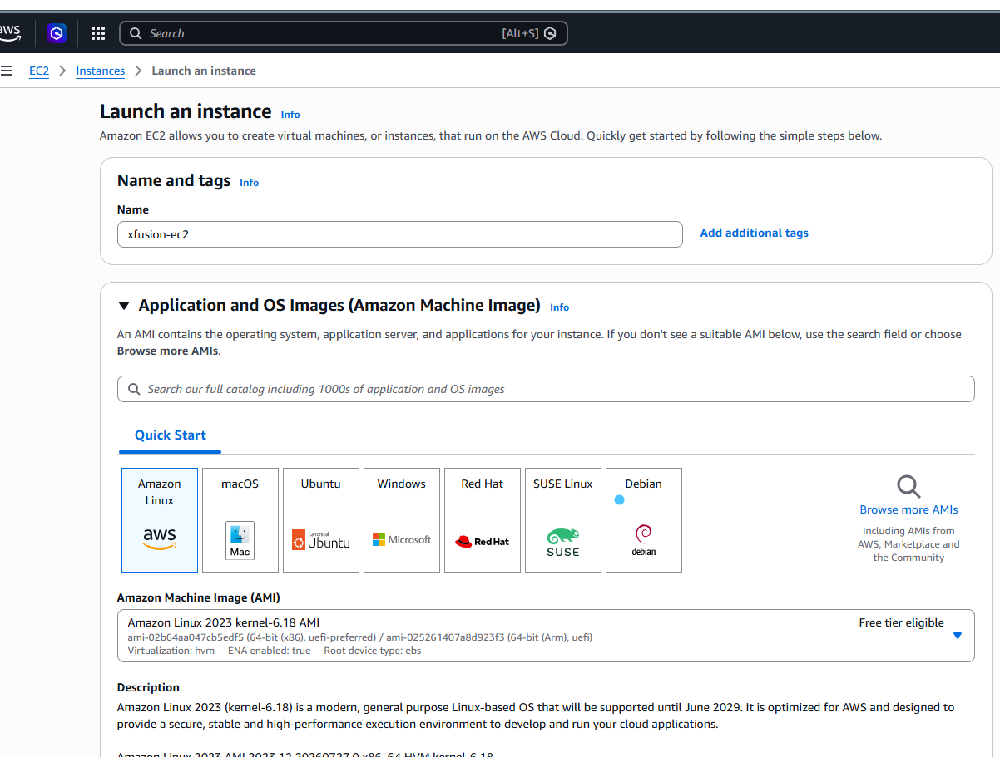
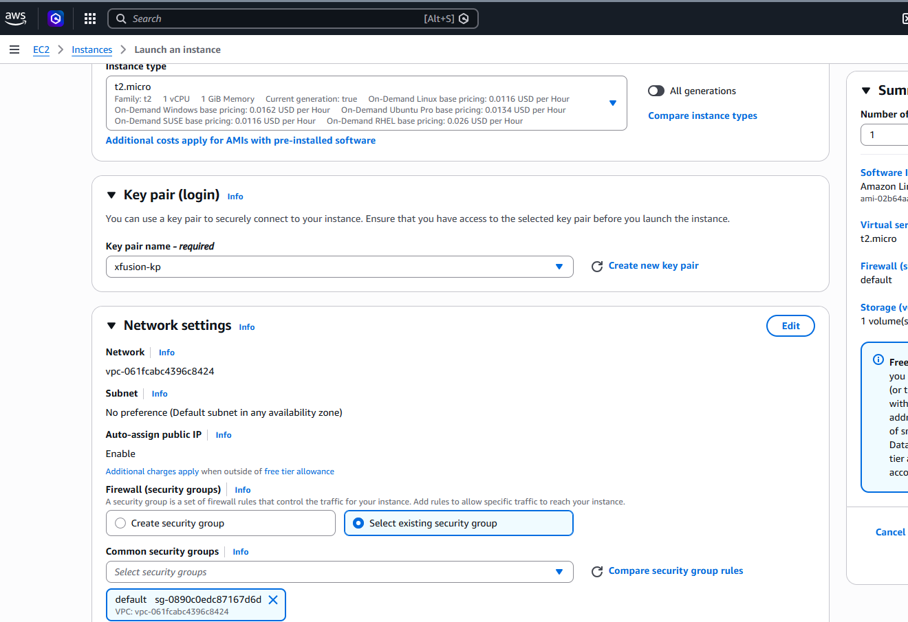
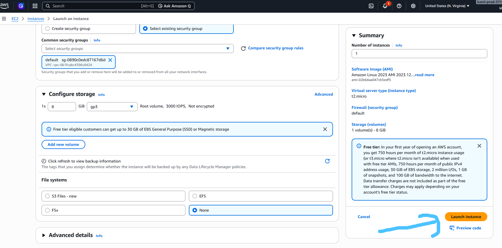

# Question

The Nautilus DevOps team is strategizing the migration of a portion of their infrastructure to the AWS cloud. Recognizing the scale of this undertaking, they have opted to approach the migration in incremental steps rather than as a single massive transition. To achieve this, they have segmented large tasks into smaller, more manageable units.

For this task, create an EC2 instance with following requirements:
1) The name of the instance must be xfusion-ec2.
2) You can use the Amazon Linux AMI to launch this instance.
3) The Instance type must be t2.micro.
4) Create a new RSA key pair named xfusion-kp.
5) Attach the default (available by default) security group.

# Steb-by-step Solution

## 1.Navigate to EC2 Dashboard:
***AWS Management Console.***
- Search for EC2 in the top search bar and select EC2 under Services.
- Click the orange Launch instance button.

## 2.Configure Instance Name & AMI:
***Name and AMI.***
- Under Name and tags, enter xfusion-ec2 in the Name field.
- Under Application and OS Images (Amazon Machine Image), select Amazon Linux (e.g., Amazon Linux 2023 AMI or Amazon Linux 2).

## 3.Select Instance Type:
***Instance Type.***
- In the Instance type section, select t2.micro from the dropdown menu.

## 4.Create and Select Key Pair:
***Key Pair.***
- In the Key pair (login) section, click Create new key pair.
- In the modal popup:
    - Key pair name: Enter xfusion-kp.
    - Key pair type: Select RSA.
    - Private key file format: Select .pem (or .ppk depending on your client requirements).
- Click Create key pair (the private key file will download automatically).

## 5.Attach Default Security Group:
***Network Settings.***
- In the Network settings section, click Edit on the top right.
- Under Firewall (security groups), choose Select existing security group.
- From the Common security groups dropdown, choose the security group named default.

## 6.Review and Launch Instance:
***Launch.***
- Review all configured parameters in the Summary panel.
- Click Launch instance.

## Verification

Once launched, navigate to EC2 > Instances. Find xfusion-ec2 and confirm:
- Instance Type: t2.micro
- Key pair name: xfusion-kp
- Security groups: default
- Instance state: running

