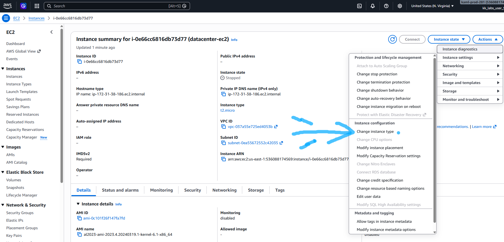
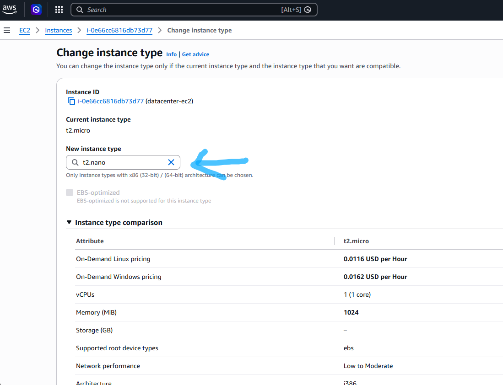

# Question
During the migration process, the Nautilus DevOps team created several EC2 instances in different regions. They are currently in the process of identifying the correct resources and utilization and are making continuous changes to ensure optimal resource utilization. Recently, they discovered that one of the EC2 instances was underutilized, prompting them to decide to change the instance type. Please make sure the Status check is completed (if its still in Initializing state) before making any changes to the instance.
- 1) Change the instance type from t2.micro to t2.nano for datacenter-ec2 instance.
- 2) Make sure the ec2 instance datacenter-ec2 is in running state after the change.

# Step by step solution

## 1. Wait for Initializing to Complete:
***EC2 Console.***
Open the EC2 Dashboard and navigate to Instances.
Locate datacenter-ec2.
Check the Status check column. If it shows Initializing, wait until it completes and displays 2/2 checks passed.

## 2. Stop the EC2 Instance:
***Instance State.***
Select the check box next to datacenter-ec2.
Click the Instance state dropdown menu at the top.
Click Stop instance, then confirm by clicking Stop.
Wait until the Instance state changes to Stopped.

## 3. Change Instance Type to t2.nano:
***Instance Configuration.***
With datacenter-ec2 selected, click the Actions menu at the top.

Navigate to Instance settings > Change instance type.
In the dropdown menu, search for and select t2.nano.
Click Apply.



## 4. Start the Instance:
***Instance State.***
Select datacenter-ec2.
Click Instance state > Start instance.
Wait until the Instance state transitions to Running.

## CLI Alternative
If performing this via the AWS CLI, execute the following commands:
```Bash
# 1. Stop the instance
aws ec2 stop-instances --instance-ids $(aws ec2 describe-instances --filters "Name=tag:Name,Values=datacenter-ec2" --query "Reservations[0].Instances[0].InstanceId" --output text)

# 2. Wait until stopped
aws ec2 wait instance-stopped --instance-ids $(aws ec2 describe-instances --filters "Name=tag:Name,Values=datacenter-ec2" --query "Reservations[0].Instances[0].InstanceId" --output text)

# 3. Change instance type to t2.nano
aws ec2 modify-instance-attribute \
  --instance-id $(aws ec2 describe-instances --filters "Name=tag:Name,Values=datacenter-ec2" --query "Reservations[0].Instances[0].InstanceId" --output text) \
  --instance-type "{\"Value\": \"t2.nano\"}"

# 4. Start the instance back up
aws ec2 start-instances --instance-ids $(aws ec2 describe-instances --filters "Name=tag:Name,Values=datacenter-ec2" --query "Reservations[0].Instances[0].InstanceId" --output text)
```

## Verification

In the EC2 Console, inspect datacenter-ec2 and verify:
- Instance type: t2.nano
- Instance state: Running