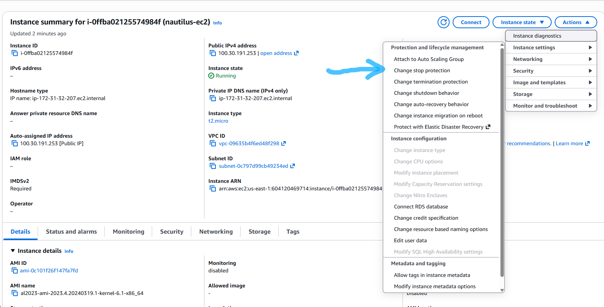

# Question

As part of the migration, there were some components added to the AWS account. Team created one of the EC2 instances where they need to make some changes now.
There is an EC2 instance named nautilus-ec2 under us-east-1 region, enable the stop protection for this instance.

#  Step-by-Step Solution

## Option 1: Using the AWS Management Console

### 1. Select Region and Locate Instance:

***AWS Console.***

Log in to the AWS Management Console.
Ensure the region selector in the top right header is set to US East (N. Virginia) us-east-1.
Navigate to EC2 > Instances.
Locate and select the instance named nautilus-ec2.

### 2. Modify Stop Protection Setting:

***Actions Menu.***

Click the Actions dropdown menu at the top.
Select Instance settings > Change stop protection.



### 3. Enable Protection:

***Configuration.***

Select the Enable checkbox under Stop protection.
Click Save.

## Option 2: Using the AWS CLI
Run the following command to enable stop protection directly:
```Bash
# 1. Get the Instance ID for nautilus-ec2
INSTANCE_ID=$(aws ec2 describe-instances \
  --region us-east-1 \
  --filters "Name=tag:Name,Values=nautilus-ec2" "Name=instance-state-name,Values=running,stopped" \
  --query "Reservations[0].Instances[0].InstanceId" \
  --output text)

# 2. Enable stop protection
aws ec2 modify-instance-attribute \
  --region us-east-1 \
  --instance-id $INSTANCE_ID \
  --disable-api-stop
```
## Verification

To verify that stop protection is active:

AWS Console: Select nautilus-ec2, click the Details tab, scroll down to the Host and placement or Instance details section, and confirm Stop protection is set to Enabled.

AWS CLI:Bash
```Bash
aws ec2 describe-instance-attribute \
  --region us-east-1 \
  --instance-id $INSTANCE_ID \
  --attribute disableApiStop
```
The returned JSON should output **"Value": true**.